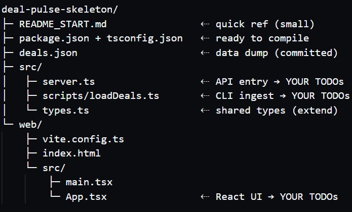

Deal-Pulse Coding Challenge – README
====================================

This file explains everything a candidate needs
to know: the **problem statement**, required objectives, how to run
the scaffold, and a couple of smoke-test commands to make sure
their environment is ready before they write a single line of code.

-------------------------------------------------------------------
1  Problem statement
-------------------------------------------------------------------

Design and implement a minimal full-stack dashboard that reads deal data from a JSON file, computes continent-level summaries, and allows drill-down into individual deals.

Mundos tracks early-stage business deals worldwide.
We want an internal tool — Deal-Pulse — that lets analysts:

1. See a quick summary of deals by continent.

2. Click on a continent to inspect individual deals.

The backend will expose two endpoints; the frontend will show a single-page dashboard based on them.

-------------------------------------------------------------------
2  Objectives (what you must build in ≤ 60 min)
-------------------------------------------------------------------

 1. **CLI ingest** – `loadDeals("deals.json")` must
    * parse 500 rows of heterogeneous JSON,
    * skip invalid rows with logged errors,
    * pre-compute aggregates so later queries are O(1).

 2. **Endpoint A – GET /deals/summary**
    Returns an array of:
    `{ continent, total, median_valuation }`.

 3. **Endpoint B – GET /deals/:id**
    Returns the chosen deal plus `days_since_announced`.

 4. **Dashboard React UI**
    * Fetches `/deals/summary` on mount,
    * Renders a table (or cards) per continent,
    * Clicking a row fetches `/deals/:id` and shows a modal.

 5. **Error handling**
    JSON body `{ code, message }`, HTTP status 4xx/5xx,
    plus ISO-timestamp console logs.

-------------------------------------------------------------------
3  Repository layout (scaffold overview)
-------------------------------------------------------------------

# 

-------------------------------------------------------------------
4  Getting started – local setup
-------------------------------------------------------------------

 ```bash
 # clone the repo (or open the Codespace link)
 pnpm install        # deps in <10 s
 pnpm dev            # API :4000   UI :5173
 curl localhost:4000/ping        # → {"message":"pong"}
 open http://localhost:5173      # heading renders
 ```

 If either server crashes, something is wrong with your environment;
 fix before writing feature code.

-------------------------------------------------------------------
5  Smoke-test checklist (should pass instantly)
-------------------------------------------------------------------

 1. **Health check**
    `curl localhost:4000/ping` → `{"message":"pong"}`

 2. **Data presence**
    `node -e "console.log(require('./deals.json').length)"` → `500`

 3. **TypeScript compile**
    `pnpm build` completes without errors (pre-TODO code only).

-------------------------------------------------------------------
6  Dataset notes
-------------------------------------------------------------------

• `deals.json` was freshly generated before your interview; it
  contains random field names (`valuation_usd` / `val_usd` / `price`)
  to discourage hard-coding. Assume nothing—inspect the data.

• Do **not** regenerate or modify this file; treat it as a read-only
  external dump.

-------------------------------------------------------------------
7  Allowed resources
-------------------------------------------------------------------

✅ Public docs, MDN, StackOverflow, npm-js search  
❌ Copy-pasting large code blobs without explaining them  
✅ Any VS Code extensions already in the Codespace  

-------------------------------------------------------------------
8  Submission / demo
-------------------------------------------------------------------

With 10 minutes left the interviewer will ask you to:
 • hit `/deals/summary` in the browser,  
 • click through a row → modal,  

Commit all work; no extra README edits required.

-------------------------------------------------------------------

Good luck, and have fun turning data into insight! 🚀
-------------------------------------------------------------------
